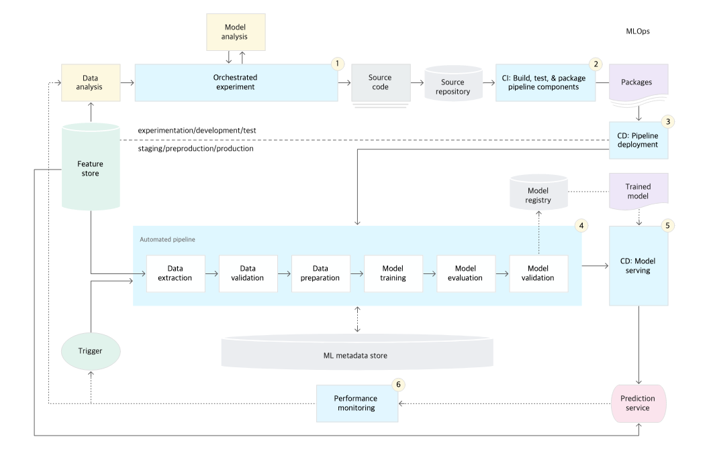

MLOps(Machine Learning(ML)+Operations(Ops))  
: ML 시스템을 빠르고 안정적으로 구축, 배포 및 운영하기 위한 표준화된 프로세스 및 기술 기능 집합

### Why MLOps?
Reasearch한 모델을 Production하는 과정에서 이슈 발생
+ 현실 세계는 매우 Risk가 있는 환경이므로, 들어오는 데이터가 계속 변함(Dynamic) → 재학습 필요 
  - CT(지속적 학습): Production 단계에서 새로운 데이터로 학습하여 만들어낸 새로운 모델 배포 반복
    - 데이터 검증: 모델 학습 전에 모델을 재학습 할 것인지 혹은 파이프라인 실행을 중지 할 것인지를 결정
    - 모델 검증: 새 데이터로 모델을 학습시킨 뒤, 해당 모델을 프로덕션에 올려보낼 것인지를 평가하고 검증
+ 배포 방법 → 모델을 API 형태 등으로 배포함 
  - CD(지속적 배포): Production 단계에서 모델 서빙
    - 모델 배포 전 모델과 인프라의 호환성을 확인(패키지, 메모리, 컴퓨팅 자원, ...)
    - API 호출 테스트
    - 서비스 부하 테스트
+ 학습 소스 코드 변화
  - CI(지속적 통합): 모델 서빙 과정에서 새로운 데이터, 데이터 스키마, 그리고 모델을 테스트하고 통합하는 과정 포함
    - 특성 추출 로직 테스트
    - 모델 학습이 수렴하는지 테스트
    - 모델에 구현된 메서드를 단위 테스트
    - NaN 값을 생성하진 않는지 테스트
    - 파이프라인의 각 구성요소 간 통합을 테스트

### Workflow Orchestrator
- 머신러닝 파이프라인 단계간 종속성 관리 및 작업 자동화
- 스케쥴링: 정해진 시간, 주기적으로 파이프라인 작업을 실행
- 스택: Apache Airflow

### 자동화 파이프라인 트리거
- 새로운 코드가 푸시되거나 데이터가 갱신되면 트리거
- GitHub Actions 또는 Apache Airflow와 같은 도구를 사용하여 트리거

### 학습된 모델 등록
1. 모델 학습이 완료되면, MLflow API를 통해 모델을 저장하고 등록
2. 모델은 Model Registry에서 버전으로 관리되며, 모델의 상태는 Staging 또는 Production 단계로 설정
3. 모델의 성능을 검토한 후, Production 배포가 가능하면 Staging 상태에서 Production 상태로 전환

### 모델 서빙
1. Fast API를 통해 MLflow에 저장된 모델 불러와 예측 요청
2. Docker & Kubernetes: 모델을 컨테이너화하여 Kubernetes 클러스터에 배포하면 자동 확장과 관리 가능

### 실시간 성능 모니터링
+ 배포된 모델의 실시간 성능(예: 응답 시간, 실제 예측 성능, 사용자 피드백 등)을 추적
1. Prometheus: 배포된 모델의 성능 지표(예: 응답 시간, 처리량 등)를 수집하는 모니터링 도구
2. Grafana: Prometheus와 함께 사용되어, 실시간 대시보드를 통해 모델 성능을 시각화

### Feature Store
+ 머신러닝 모델에서 사용하는 features를 중앙에서 관리하고 제공하는 저장소
+ 스택: Feast, Hopsworks, Databricks Feature Store, AWS Sagemaker.

---
# Reference
[MLOps 흐름](https://cloud.google.com/architecture/mlops-continuous-delivery-and-automation-pipelines-in-machine-learning)  
[머신러닝 오퍼레이션 자동화, MLOps-변성윤 마스터](https://zzsza.github.io/mlops/2018/12/28/mlops/)
[MLOps란?](https://velog.io/@whattsup_kim/MLOps%EB%9E%80)