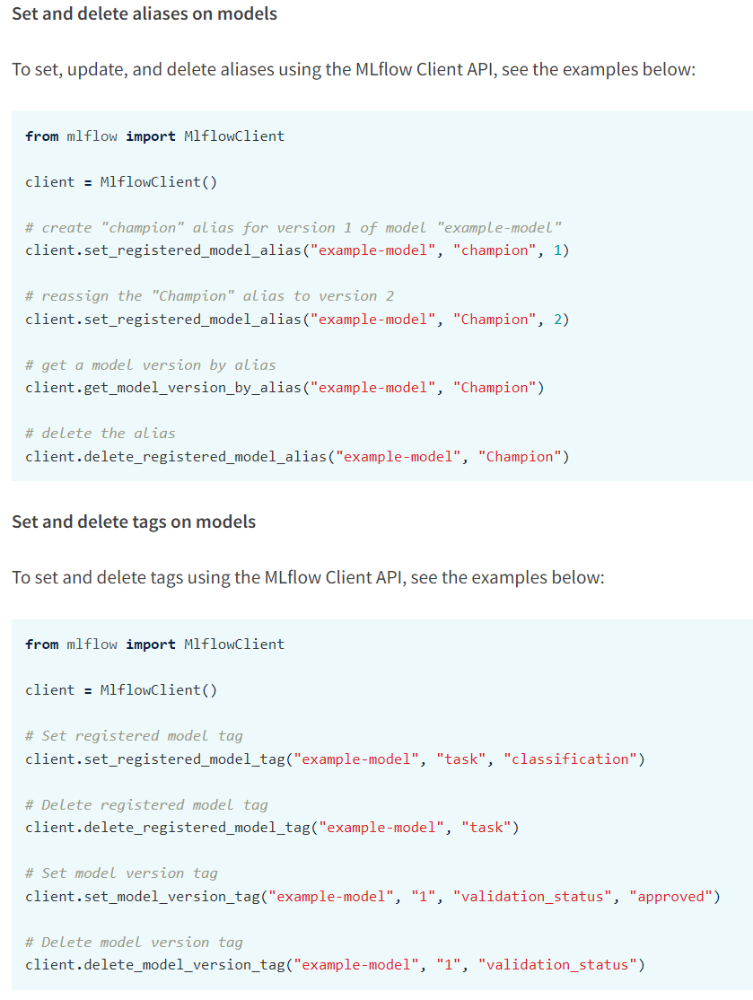

- 모델 저장
  ```
  # PyTorch 모델을 MLflow 형식으로 저장 > 저장된 모델 mlflow.pyfunc.load_model()을 통해 로드하여 추론 가능
  mlflow.pytorch.log_model()
  # MLflow 모델을 PyTorch 모델 객체로 로드
  mlflow.pytorch.load_model()
  ```
- 모델 tag와 alias를 이용해 모델 배포와 조직화 + tag: 등록된 모델 및 모델 버전과 연관시키는 키-값 쌍으로, 이를 통해 기능 또는 상태별로 레이블을 지정하고 분류 + (예시: `task:question-answering`, `validation_status:pending`: 사전 배포 검증을 거치는 과정, `validation_status:approved` : 배포 승인 버전 + alias: unique함, 모델의 여러 alias 할당/제거 가능, 변경 가능 + "Production" == "Champion", "Staging", "Archived", or "None"
  
- Registery 모델 list, search
  ```
  # RegisteredModel객체 리스트 반환
  mlflowclient.search_registered_models()
  # 특정 model의 이름을 이용해 model 정보를 가져옴
  mlflowclient.search_model_versions("name=model_name")
  ```
- alias로 모델 로드
  ```
  model = mlflow.pyfunc.load_model(model_uri=f"models:/{model_name}@Champion")
  ```
- 모델 삭제
  - 해당 모델의 모든 버전 삭제
  ```
  mlflowclient.delete_registered_model(name=model_name)
  ```
  - 해당 모델의 특정 버전 삭제
  ```
  mlflowclient.delete_model_version(name=model_name, version=version)
  ```

* `docker-compose up --build` : 코드에 변화가 생긴다면 `docker-compose.yml`설정대로 새로운 이미지를 만듦, 프론트 + DB + 서버를 한번에 실행
